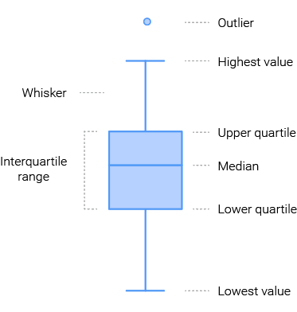

```{r setup, include=FALSE}
knitr::opts_chunk$set(echo = TRUE)
```

## An Example

```{r, echo=F}
import::from(MASS, Boston)
import::from(magrittr, "%>%", "%$%", .into = "operators")
Auto <- read.csv("../data/Auto.csv", header = T, na.strings = "?")

library(ggplot2)
options(scipen = 999) # turn off scientific notation like 1e+06
```

Check dataset summary:

```{r}
Boston %>% summary()
```

Scatter plot with linear smoothing:

```{r}
g <- Boston %>%
  dplyr::mutate(safe = ifelse(crim < 0.08, T, F)) %>%
  dplyr::mutate(new = ifelse(age < 45, T, F)) %>%
  ggplot(data = ., mapping = aes(x = lstat, y = medv)) +
  geom_point(
    mapping = aes(color = new %>% factor(), shape = safe %>% factor()),
    size = 2.0, alpha = 0.4,
  ) +
  scale_color_manual(values = c("#00AFBB", "#FC4E07", "#e7b800")) +
  scale_shape_manual(values = c(1, 19, 24)) +
  geom_smooth(
    method = "lm", formula = y ~ x, color = "firebrick",
    linewidth = 1.5,
  ) +
  labs(
    title = "Medium Value vs. Low Percentage", subtitle = "from boston dataset",
    caption = "figure 1. Linear Regression",
    x = "Low Percentage (%)", y = "Medium Value ($ 1,000)",
    color = "New", shape = "Safe"
  ) +
  theme_grey()

g + labs(tag = "original")

g + coord_cartesian(ylim = c(0, 30)) + labs(tag = "cropped")
```

## details

shapes

```{r}
data.frame(shape = 0:24) %>% ggplot(data = ., mapping = aes(0, 0)) +
  geom_point(mapping = aes(shape = shape), size = 5, fill = "red") +
  facet_wrap(~shape) +
  scale_shape_identity() +
  theme_void()
```

## Deja vu

```{r}
Auto %>% summary()
```

### Continous vs. Discrete

Box Plot:



**TL;DR**

$\begin{aligned}
Q_1 &= \mu - 0.675 \sigma
\\
Q_3 &= \mu + 0.675 \sigma
\end{aligned}$

```{r}
Auto %>%
  dplyr::mutate(new = ifelse(year > 79, T, F)) %>%
  ggplot(data = ., mapping = aes(x = cylinders %>% factor(), y = mpg)) +
  stat_boxplot(
    geom = "errorbar",
    # position = "dodge2",
    linetype = "dotted",
    width = 0.1,
    coef = 1.5,
  ) +
  geom_boxplot(
    linewidth = 0.2,
    shape = "dotted",
    fill = "red",
    outlier.stroke = 0.5,
    outlier.alpha = 0.5,
    outlier.shape = 1,
    varwidth = T, show.legend = T,
    # notch = F, notchwidth = 0.5,
    # coef = 1.5,
    # width = 0.8,
    # width.errorbar = 0.5,
  ) +
  theme_grey() +
  labs(
    title = "Feul Efficiency vs. #Cylinder", x = "#Cylinder",
    y = "Miles / Galon"
  )
```

### One Continous

Histogram

```{r}
Auto %$% (ggplot(mapping = aes(x = mpg)) +
  geom_histogram(
    colour = 1,
    fill = "darkcyan",
    breaks = pretty(range(mpg),
      n = nclass.Sturges(mpg), min.n = 1
    )
  )) +
  labs(
    title = "Miles per Galon Distribution",
    subtitle = "Auto Dataset"
  )
```

### One Discrete

Bar Chart

```{r}
Auto %>% ggplot(data = .) +
  geom_bar(
    mapping = aes(
      x = factor(cylinders),
      fill = factor(cylinders)
    ),
    alpha = 0.5,
  ) +
  scale_color_brewer()
```

### Linear Models

```{r}
mdl <- Boston %$% lm(medv ~ I(1 / lstat))
```

Create predictions with the model above:

```{r}
data <- Boston %>% dplyr::mutate(pred = predict(mdl))
```

Model Visualization:

```{r}
data %>%
  ggplot(data = ., mapping = aes(x = lstat, y = medv)) +
  geom_point(
    mapping = aes(x = lstat, y = medv),
    size = 2.0, alpha = 0.4, color = "darkcyan"
  ) +
  geom_line(
    mapping = aes(x = lstat, y = pred),
    color = "firebrick", linewidth = 1.0,
  ) +
  geom_smooth(
    method = "lm", formula = y ~ x, color = "orange",
    linewidth = 1.0,
  )
```

More tricks:

```{r}
data %>%
  dplyr::mutate(safe = ifelse(crim < 0.08, T, F)) %>%
  dplyr::mutate(new = ifelse(age < 45, T, F)) %>%
  ggplot(data = .) +
  geom_point(
    mapping = aes(
      x = lstat, y = medv, color = new %>% factor(),
      shape = safe %>% factor()
    ),
    size = 2.0, alpha = 0.4,
  ) +
  scale_color_manual(values = c("#00AFBB", "#FC4E07", "#e7b800")) +
  scale_shape_manual(values = c(1, 19, 24)) +
  geom_line(
    mapping = aes(x = lstat, y = pred), color = "firebrick",
    linewidth = 1.5,
  ) +
  labs(
    title = "Medium Value vs. Low Percentage",
    subtitle = "from boston dataset",
    caption = "figure 1. Linear Regression",
    x = "Low Percentage (%)", y = "Medium Value ($ 1,000)",
    color = "New", shape = "Safe"
  ) +
  theme_grey()
```

## Reference

- http://r-statistics.co/Complete-Ggplot2-Tutorial-Part1-With-R-Code.html
- https://towardsdatascience.com/why-1-5-in-iqr-method-of-outlier-detection-5d07fdc82097
